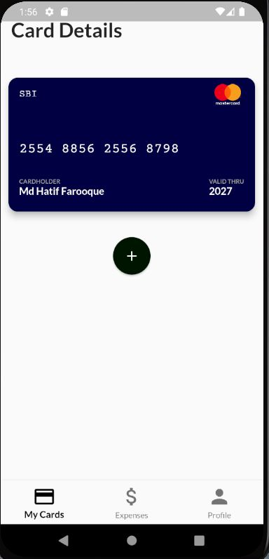
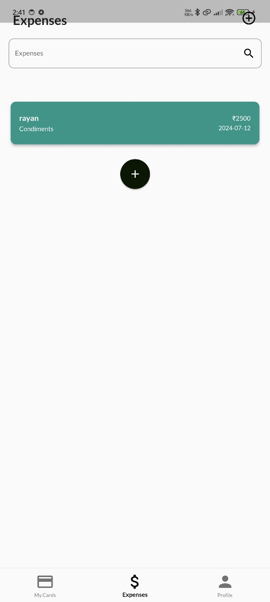
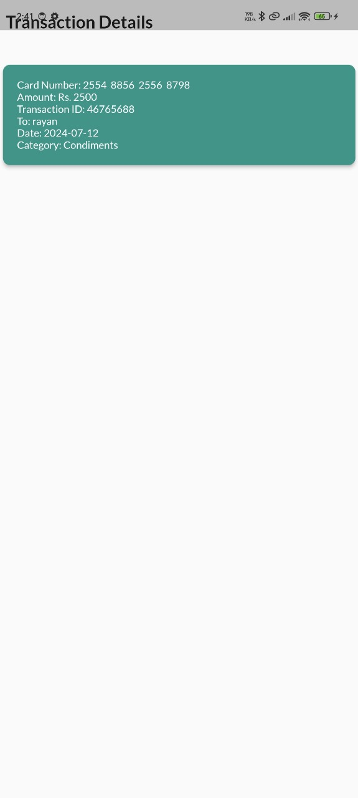
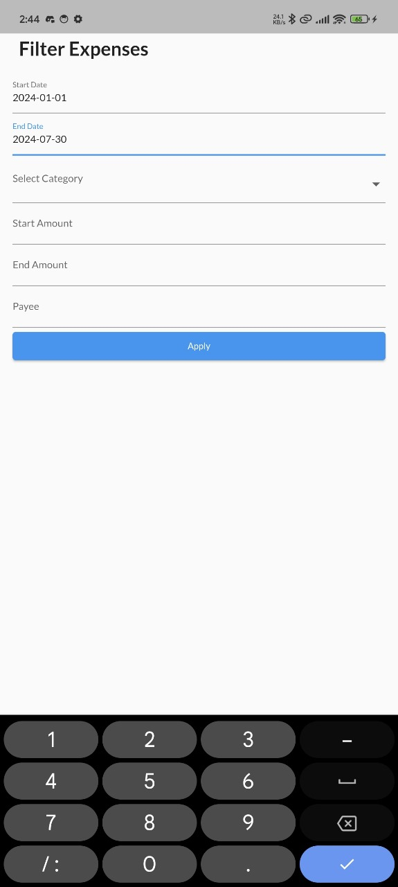

# Card Management

## Overview

Card Management is a comprehensive solution designed to manage various types of cards and track expenses efficiently. The project leverages Flutter for the frontend and PHP for the backend, with MySQL as the database, all hosted on XAMPP for a seamless development experience.

## Features

- **Card Management**: Add, update, and delete different types of cards.
- **Expense Tracking**: Track expenses linked to each card, providing insights and analysis.
- **Optimized Database**: Efficient data storage and retrieval using MySQL.

## Tools & Technologies

- **Frontend**: Flutter
- **Backend**: PHP
- **Database**: MySQL
- **Server**: XAMPP

## Installation

### Prerequisites

- Flutter installed on your machine.
- XAMPP installed and running.
- MySQL database setup.

### Steps

1. **Clone the Repository**:
    ```bash
    git clone https://github.com/yourusername/card-management.git
    cd card-management
    ```

2. **Setup the Backend**:
    - Place the PHP files in the `htdocs` directory of your XAMPP installation.
    - Create a MySQL database and import the provided SQL dump file located in the `database` folder.

3. **Setup the Frontend**:
    ```bash
    flutter pub get
    flutter run
    ```

## Usage

1. **Start XAMPP**: Ensure Apache and MySQL are running.
2. **Run the Flutter App**: Use the command `flutter run` in the project directory.

## Screenshots

### Card View


### Expenses View


### Transaction Detail


### Filter Expenses


## Contributing

Contributions are welcome! Please fork the repository and submit a pull request for any improvements.


## Contact

For any queries, feel free to reach out at [my email(mailto:mthraza72@gmail.com).
